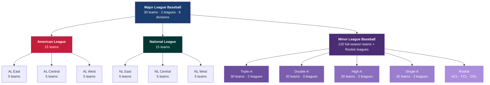
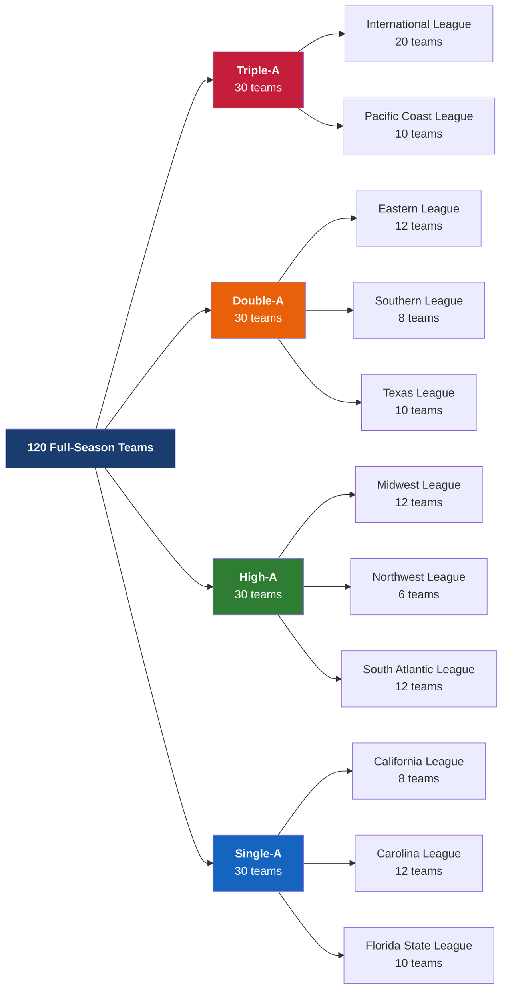
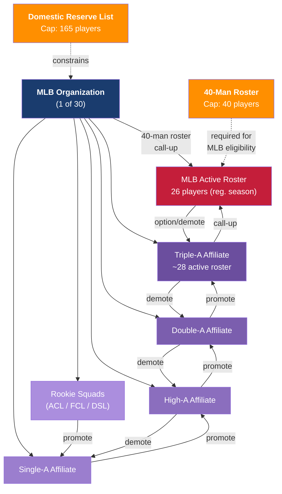
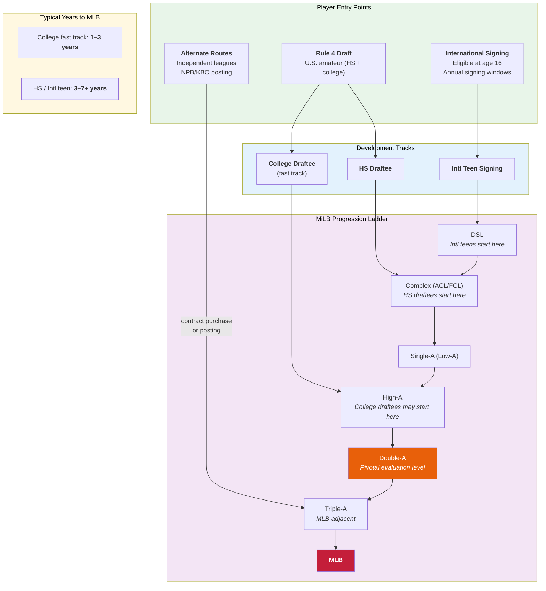
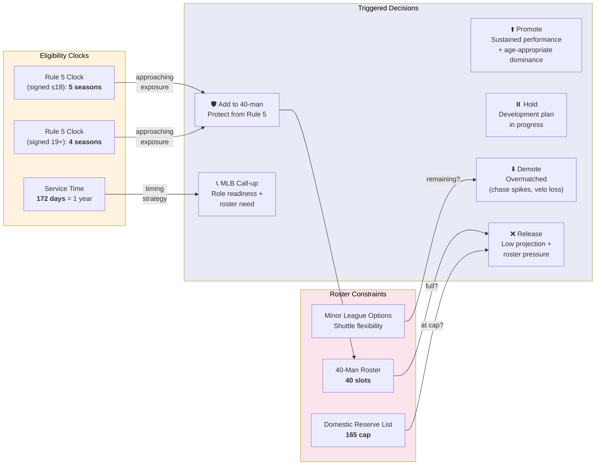
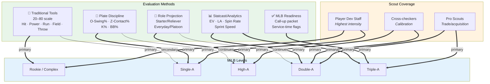
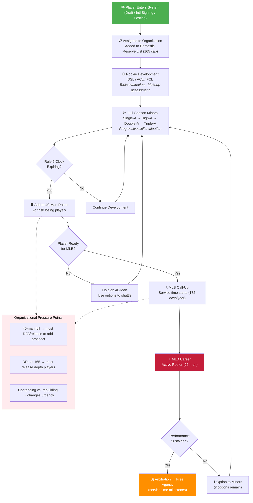
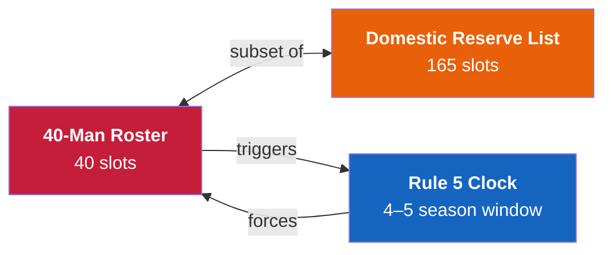
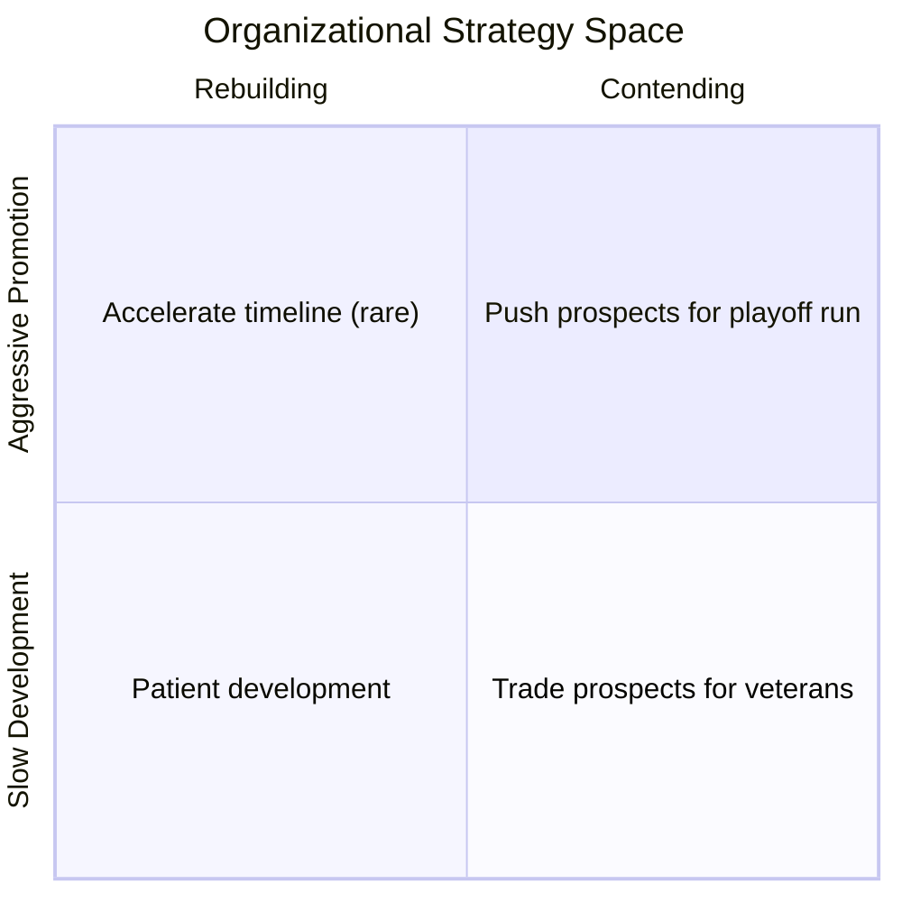

# MLB–MiLB Master Technical Analysis

A comprehensive systems-level view of how Major League Baseball and Minor League Baseball interconnect — from organizational hierarchy and team structure, through player development pipelines, to the roster mechanics that constrain every decision.

---

## 1. Organizational Hierarchy

MLB sits at the top of a vertically integrated system. Every minor league player, team, and development program operates under MLB organizational control.

**Key relationship:** Each of the 30 MLB organizations controls exactly **4 full-season affiliates** (one at each level) plus squads in shared Rookie leagues. MiLB teams do not independently acquire players — all player movement flows from the parent MLB organization.

---

## 2. Full-Season League Map

The 120 full-season teams are organized into 11 named leagues. This tree shows the level → league → team-count breakdown:

---

## 3. Single-Organization Affiliate Pipeline

Every MLB team controls a complete vertical pipeline. Here is the structural template showing how one organization's affiliates connect:

**Critical constraints:** The 40-man roster is the gateway to MLB. The 165-player Domestic Reserve List caps total organizational depth. Both create pressure that drives roster decisions at every level.

---

## 4. Player Entry & Development Pipeline

Players enter from three distinct funnels and progress through the system at different speeds:

---

## 5. Roster Mechanics & Decision Gates

Roster rules create specific decision triggers that connect player development to organizational strategy:

### Decision Matrix

| Trigger | Action | Roster Impact |
|---------|--------|---------------|
| Rule 5 exposure approaching | Add to 40-man or accept risk | Consumes 40-man slot |
| 40-man full, prospect ready | DFA/trade/release existing player | Opens 40-man slot |
| DRL at 165, low-upside depth | Release organizational players | Opens DRL slot |
| Options remaining | Shuttle between MLB and minors | No permanent roster change |
| Service time near threshold | Time call-up strategically | Affects FA/arbitration clock |
| Sustained dominance at level | Promote to next level | No roster-limit impact (within MiLB) |
| Overmatched (chase/velo drop) | Demote to better-fit level | No roster-limit impact (within MiLB) |

---

## 6. Scouting & Evaluation by Level

Evaluation emphasis shifts dramatically as players advance. This diagram maps tools/methods to the levels where they dominate:

### Public Statcast Availability Gap

| Level | Public Tracking | Implication |
|-------|:---------------:|-------------|
| Triple-A | ✅ Complete | Full data-driven evaluation possible |
| Double-A | ❌ None | Reliance on internal tools + traditional scouting |
| High-A | ⚠️ Limited | Subset of parks only |
| Single-A | ⚠️ Limited | Subset of parks since 2021 |
| Rookie | ❌ None | Purely tools-based / internal tech |

This gap at Double-A — the most pivotal evaluation level — means 40-man/Rule 5 protection decisions are made with **less public data** than at any other critical stage.

---

## 7. How It All Connects: System Flow

This end-to-end diagram shows how a player moves from entry through to MLB, touching every system:

---

## 8. MLB–MiLB Cross-Reference Matrix

This table maps every wiki page to the system components it covers, showing where documentation overlaps and connects:

| System Component | Source Docs | Entity Pages | Concept Pages | Analysis |
|-----------------|:-----------:|:------------:|:-------------:|:--------:|
| **MLB structure** (30 teams, divisions, postseason) | [Leagues & Divisions](../sources/mlb-leagues-divisions-explained.md) | [MLB](../entities/major-league-baseball.md) | — | [Numbers](../analyses/mlb-milb-by-the-numbers.md) |
| **AL/NL history & rule unification** | [AL vs NL Rules](../sources/al-nl-rule-differences.md) | [MLB](../entities/major-league-baseball.md) | [DH](../concepts/designated-hitter.md) | — |
| **Broadcasting & 2026 schedule** | [SNB Schedule](../sources/sunday-night-baseball-2026-schedule.md) | [MLB](../entities/major-league-baseball.md) | — | [Numbers](../analyses/mlb-milb-by-the-numbers.md) |
| **MiLB levels & league structure** | [Ecosystem](../sources/minor-league-baseball-ecosystem.md), [Teams Ref](../sources/mlb-milb-teams-by-affiliate.md) | [MiLB](../entities/minor-league-baseball.md) | — | [Numbers](../analyses/mlb-milb-by-the-numbers.md) |
| **Team affiliates & league rosters** | [Teams Ref](../sources/mlb-milb-teams-by-affiliate.md) | [MiLB](../entities/minor-league-baseball.md) | — | [Numbers](../analyses/mlb-milb-by-the-numbers.md) |
| **Rookie leagues (ACL, FCL, DSL)** | [Teams Ref](../sources/mlb-milb-teams-by-affiliate.md) | [MiLB](../entities/minor-league-baseball.md) | — | [Numbers](../analyses/mlb-milb-by-the-numbers.md) |
| **Player entry & development tracks** | [Ecosystem](../sources/minor-league-baseball-ecosystem.md) | [MiLB](../entities/minor-league-baseball.md) | [Pathways](../concepts/mlb-player-development-pathways.md) | [Numbers](../analyses/mlb-milb-by-the-numbers.md) |
| **Scouting & evaluation methods** | [Ecosystem](../sources/minor-league-baseball-ecosystem.md) | — | [Scouting](../concepts/mlb-scouting-evaluation.md) | [Numbers](../analyses/mlb-milb-by-the-numbers.md) |
| **Roster mechanics & constraints** | [Ecosystem](../sources/minor-league-baseball-ecosystem.md) | [MLB](../entities/major-league-baseball.md), [MiLB](../entities/minor-league-baseball.md) | [Roster](../concepts/mlb-roster-mechanics.md) | [Numbers](../analyses/mlb-milb-by-the-numbers.md) |

---

## 9. Key Systemic Insights

### The Three Binding Constraints

Every decision in the MLB–MiLB system is shaped by three interlocking caps:

1. **The 40-Man squeeze:** Only 40 players can be MLB-eligible at any time. Adding a prospect means removing someone. Every Rule 5 protection decision has a cost.

2. **The DRL ceiling:** 165 total organizational players in-season. This means even promising Low-A players consume a scarce resource. Organizations must project future value against present roster cost.

3. **The Rule 5 countdown:** The 4–5 season protection clock creates a _forced evaluation timeline_. It doesn't matter if a player "needs more time" — if the clock expires, the organization must add them to the 40-man or risk losing them to another team for minimal cost.

### The Double-A Paradox

Double-A is simultaneously:
- The **most important evaluation level** (where organizations decide 40-man/Rule 5 fate)
- The level with the **least public tracking data** (no public Statcast)

This means the highest-stakes prospect decisions rely disproportionately on traditional scouting and internal proprietary tools — creating information asymmetry between organizations with better vs. weaker internal analytics.

### The Development-vs-Winning Tension

- **Rebuilding + Patient:** Maximize development time; tolerate Rule 5 exposure on fringe players
- **Rebuilding + Aggressive:** Rare — sometimes done for service-time manipulation
- **Contending + Aggressive:** Push top prospects to fill MLB holes; prioritize call-up packets
- **Contending + Trade:** Sell prospect depth for proven MLB contributors at trade deadlines

---

## Sources

All content synthesized from existing wiki pages:
[MLB Leagues & Divisions](../sources/mlb-leagues-divisions-explained.md) · [SNB 2026 Schedule](../sources/sunday-night-baseball-2026-schedule.md) · [AL vs NL Rules](../sources/al-nl-rule-differences.md) · [MiLB Ecosystem](../sources/minor-league-baseball-ecosystem.md) · [MiLB Teams Reference](../sources/mlb-milb-teams-by-affiliate.md) · [MLB Entity](../entities/major-league-baseball.md) · [MiLB Entity](../entities/minor-league-baseball.md) · [DH](../concepts/designated-hitter.md) · [Pathways](../concepts/mlb-player-development-pathways.md) · [Scouting](../concepts/mlb-scouting-evaluation.md) · [Roster Mechanics](../concepts/mlb-roster-mechanics.md) · [Numbers](../analyses/mlb-milb-by-the-numbers.md)
